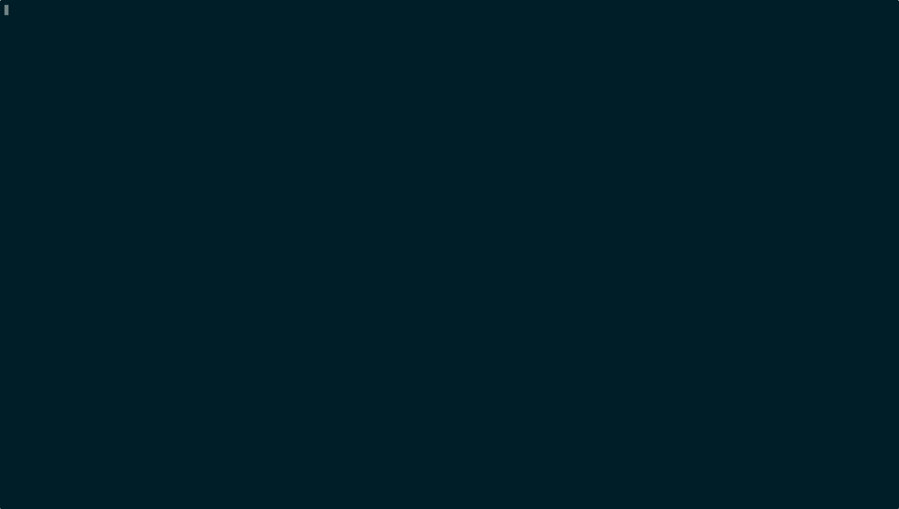

# claudicant

A TUI tool for reviewing GitHub pull requests with Claude AI assistance.

Fetch a PR, browse commits and diffs with syntax highlighting, let Claude review the code, curate the comments (accept, reject, edit), then submit the review back to GitHub — all from your terminal.



## Prerequisites

- [Rust](https://rustup.rs/) (for building)
- [GitHub CLI](https://cli.github.com/) (`gh`) — authenticated with `gh auth login`
- [Claude Code](https://docs.anthropic.com/en/docs/claude-code) (`claude`) — installed and working
- `$EDITOR` set to your preferred editor (falls back to `vi`)

## Install

```bash
git clone https://github.com/carlocaione/claudicant.git
cd claudicant
cargo install --path .
```

## Step-by-step usage

### 1. Launch claudicant on a PR

Navigate to a cloned GitHub repository and run:

```bash
claudicant 42
```

Claudicant fetches the PR metadata, downloads the commits, and generates full-file diffs locally. You'll see a two-panel TUI: the **commit list** on the left (with a detail pane below it) and the **diff view** on the right.

### 2. Browse the code

Use `j`/`k` to navigate commits in the left panel. The diff view updates automatically. Press `Tab` to switch focus to the diff panel, then `j`/`k` to scroll through the code. Press `p` to read the PR description.

### 3. Run Claude's review

Press `r` to open the review prompt dialog. You'll see the prompt that will be sent to Claude, including the list of commits. You can:

- Press `a` to accept and send it as-is
- Press `e` to edit the prompt in your `$EDITOR` before sending
- Press `/` to append a custom prompt (e.g. "focus on security issues")

Claude reviews the entire PR and returns structured comments pinned to specific files and lines. A spinner shows while the review is in progress — press `Esc` to cancel if needed.

### 4. Triage the comments

After the review completes, you'll see comment markers in the diff view (colored dots on the left margin) and a list of comments nested under each commit in the left panel.

Navigate to a comment using `n`/`N` (next/previous) or by pressing `Enter` on a comment in the commit list. Each comment expands inline showing the severity, file, line, and Claude's feedback.

For each comment, decide:

- `a` — **Accept**: include this comment in the review you'll submit to GitHub
- `x` — **Reject**: discard this comment
- `e` — **Edit**: open in `$EDITOR` to rewrite before accepting

Use `A` or `X` to accept or reject all pending comments in the current commit at once.

### 5. Add your own comments

Press `Enter` on any line in the diff to open `$EDITOR` and write your own comment. Press `Enter` on a file header to leave a file-level comment. Your manual comments are always marked as accepted and will be included in the submission.

### 6. Submit the review

Once all comments are addressed (accepted or rejected), press `S` to submit. A dialog shows the review summary (from Claude's analysis) that you can edit. Press `t` to cycle the review type:

- **Comment** — neutral feedback (default)
- **Approve** — approve the PR (green checkmark)
- **Request Changes** — block until author addresses feedback

Press `a` to submit the review to GitHub. Accepted comments appear as inline review comments on the PR.

## CLI options

```bash
claudicant 42                                    # Review PR #42
claudicant '#42'                                 # Also works with #
claudicant 42 --theme solarized-dark              # Set color theme
claudicant 42 --model sonnet --effort high       # Claude settings
claudicant 42 --log-file /tmp/claudicant.log     # Debug logging
claudicant 42 -r /path/to/repo                   # Specify repo path
```

| Flag | Description |
|------|-------------|
| `-r, --repo <PATH>` | Path to git repo (default: current directory) |
| `--theme <NAME>` | Color theme: `terminal` (default), `solarized-dark` |
| `--model <MODEL>` | Claude model: `opus`, `sonnet`, `haiku` |
| `--effort <LEVEL>` | Effort level: `low`, `medium`, `high`, `max` |
| `--log-file <PATH>` | Log Claude responses and GitHub API calls |

## Keybindings

### Global

| Key | Action |
|-----|--------|
| `?` | Help |
| `s` | Settings |
| `p` | PR description |
| `r` | Run Claude review |
| `A` / `X` | Accept / reject all pending comments (current commit) |
| `S` | Submit review to GitHub |
| `Tab` | Switch panel |
| `q` / `Esc` | Quit |

### Commit list

| Key | Action |
|-----|--------|
| `j` / `k` | Navigate commits |
| `g` / `G` | First / last |
| `Enter` / `l` | Open in diff panel |

### Diff panel

| Key | Action |
|-----|--------|
| `j` / `k` | Navigate lines |
| `Ctrl-D` / `Ctrl-U` | Half page down / up |
| `g` / `G` | First / last line |
| `n` / `N` | Next / previous comment |
| `Enter` | Open comment or add new one |
| `h` / `Esc` | Back to commit list |

### Viewing a comment

| Key | Action |
|-----|--------|
| `a` | Accept |
| `x` | Reject |
| `e` / `Enter` | Edit in `$EDITOR` |
| `Esc` | Close |

### Review prompt dialog

| Key | Action |
|-----|--------|
| `a` / `Enter` | Accept and send to Claude |
| `e` | Edit in `$EDITOR` |
| `/` | Select a custom prompt |
| `Esc` | Cancel |

### Submit dialog

| Key | Action |
|-----|--------|
| `a` / `Enter` | Submit |
| `e` | Edit summary in `$EDITOR` |
| `t` | Cycle review type (Comment / Approve / Request Changes) |
| `Esc` | Cancel |

## Configuration

Config files are loaded in order, each overriding the previous:

1. `~/.config/claudicant/config.toml` (global)
2. `.claudicant/config.toml` (project-local)
3. CLI flags

### Example config

```toml
theme = "terminal"
model = "sonnet"
effort = "high"
default_prompt = "basic"
commit_panel_width = 30
```

| Setting | Values | Default |
|---------|--------|---------|
| `theme` | `terminal`, `solarized-dark` | `terminal` |
| `model` | `opus`, `sonnet`, `haiku` | Claude's default |
| `effort` | `low`, `medium`, `high`, `max` | Claude's default |
| `default_prompt` | Name of a `.md` file in prompts dir | none |
| `commit_panel_width` | 10–80 (percentage) | 30 |

## Custom prompts

Create `.md` files to customize what Claude focuses on during review:

- `~/.config/claudicant/prompts/` — global prompts
- `.claudicant/prompts/` — project-local prompts (shadow global by name)

Example prompt (`.claudicant/prompts/security.md`):

```
Focus on security issues only: injection vulnerabilities, unsafe
deserialization, improper input validation, authentication and
authorization flaws, and sensitive data exposure.
```

The `default_prompt` config setting auto-appends the named prompt to every review. Press `/` in the review prompt dialog to pick a different one.

## License

MIT
